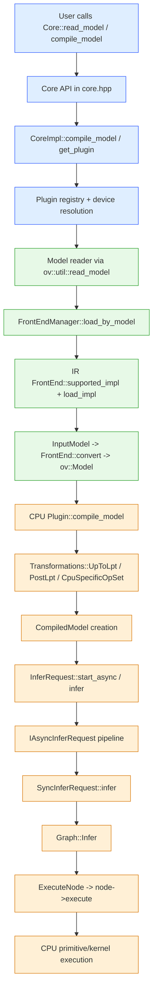

# OpenVINO inference flow: source-grounded execution path

This document traces the verified end-to-end flow for a model from public runtime API call to actual CPU execution. The path below is the reference implementation for the CPU backend. GPU and NPU follow the same top-level runtime contract but use different plugin-specific compilation and graph stages.

## Executive summary

The runtime is intentionally layered:

1. Public API entry points live in [openvino/src/inference/include/openvino/runtime/core.hpp](../../openvino/src/inference/include/openvino/runtime/core.hpp).
2. Runtime resolution and plugin selection happen in [openvino/src/inference/src/dev/core_impl.cpp](../../openvino/src/inference/src/dev/core_impl.cpp).
3. Model reading uses the frontend manager in [openvino/src/inference/src/model_reader.cpp](../../openvino/src/inference/src/model_reader.cpp) and the frontend implementation in [openvino/src/frontends/common/src/manager.cpp](../../openvino/src/frontends/common/src/manager.cpp) and [openvino/src/frontends/ir/src/frontend.cpp](../../openvino/src/frontends/ir/src/frontend.cpp).
4. The canonical in-memory graph representation is the OV Model in [openvino/src/core/include/openvino/core/model.hpp](../../openvino/src/core/include/openvino/core/model.hpp).
5. CPU compilation is handled in [openvino/src/plugins/intel_cpu/src/plugin.cpp](../../openvino/src/plugins/intel_cpu/src/plugin.cpp) and the CPU transformation pipeline in [openvino/src/plugins/intel_cpu/src/transformations/transformation_pipeline.cpp](../../openvino/src/plugins/intel_cpu/src/transformations/transformation_pipeline.cpp).
6. The compiled backend model creates infer requests in [openvino/src/plugins/intel_cpu/src/compiled_model.cpp](../../openvino/src/plugins/intel_cpu/src/compiled_model.cpp).
7. Async and sync inference scheduling are in [openvino/src/inference/src/cpp/infer_request.cpp](../../openvino/src/inference/src/cpp/infer_request.cpp) and [openvino/src/inference/src/dev/iasync_infer_request.cpp](../../openvino/src/inference/src/dev/iasync_infer_request.cpp).
8. Actual backend execution runs in the CPU graph and per-node executor path, with the main handoff at [openvino/src/plugins/intel_cpu/src/graph.cpp](../../openvino/src/plugins/intel_cpu/src/graph.cpp) and the node executor at [openvino/src/plugins/intel_cpu/src/node.cpp](../../openvino/src/plugins/intel_cpu/src/node.cpp).

## End-to-end flow

## Stage-by-stage trace with evidence

### 1) Public runtime entry point

The public OpenVINO Runtime API exposes model loading and compilation on Core and exposes read_model / compile_model overloads in [openvino/src/inference/include/openvino/runtime/core.hpp](../../openvino/src/inference/include/openvino/runtime/core.hpp). These overloads are the entry point for a user application and then delegate into the runtime implementation.

### 2) Runtime resolution and plugin selection

The actual implementation sits in [openvino/src/inference/src/dev/core_impl.cpp](../../openvino/src/inference/src/dev/core_impl.cpp). This file contains the registry, plugin lookup, and compile path. The key behavior is:

- CoreImpl resolves the device name and underlying plugin via the registry.
- The plugin is created lazily when needed.
- compile_model dispatches to the selected plugin with the final configuration.

This is the core mechanism that turns a top-level API call into a device-specific compile call.

### 3) Model reading and frontend selection

Model loading is performed through [openvino/src/inference/src/model_reader.cpp](../../openvino/src/inference/src/model_reader.cpp). The function ov::util::read_model builds a FrontEndManager, searches for a matching frontend, and then calls FE->convert(inputModel).

For example:

- FrontEndManager::load_by_model searches prioritized frontend plugins and then falls back to scanning all loaded frontends in [openvino/src/frontends/common/src/manager.cpp](../../openvino/src/frontends/common/src/manager.cpp).
- The IR frontend confirms whether a file looks like IR by checking the XML root and version field in [openvino/src/frontends/ir/src/frontend.cpp](../../openvino/src/frontends/ir/src/frontend.cpp).
- The actual load and convert path is defined by FrontEnd::load_impl and convert in the frontend base interface in [openvino/src/frontends/common/include/openvino/frontend/frontend.hpp](../../openvino/src/frontends/common/include/openvino/frontend/frontend.hpp) and [openvino/src/frontends/common/include/openvino/frontend/input_model.hpp](../../openvino/src/frontends/common/include/openvino/frontend/input_model.hpp).

This is where the storage format (IR/ONNX/etc.) is translated into an in-memory OpenVINO graph.

### 4) In-memory graph representation

The resulting graph is an ov::Model, whose public definition is in [openvino/src/core/include/openvino/core/model.hpp](../../openvino/src/core/include/openvino/core/model.hpp). This object encapsulates the graph itself, its parameters, results, and topology relationships. At this stage the runtime no longer cares whether the model came from IR, ONNX, or another format; it is working with the OV graph abstraction.

### 5) CPU plugin compile pipeline

The primary backend-specific compile path is the CPU plugin in [openvino/src/plugins/intel_cpu/src/plugin.cpp](../../openvino/src/plugins/intel_cpu/src/plugin.cpp). The plugin does the following:

- validates accepted input precision
- clones the model to avoid mutating the original graph
- configures execution parameters and performance hints
- runs CPU-specific transformations
- creates a CompiledModel wrapper attached to the plugin

The essential transformation ordering is visible in [openvino/src/plugins/intel_cpu/src/transformations/transformation_pipeline.cpp](../../openvino/src/plugins/intel_cpu/src/transformations/transformation_pipeline.cpp):

- UpToLpt()
- PostLpt()
- Snippets()
- CpuSpecificOpSet()

These passes convert the generic ov::Model into a CPU-friendly graph before execution. This is the backend-specific lowering stage that makes the graph executable on CPU.

### 6) CompiledModel creation and request generation

The backend CompiledModel owns the graph state and creates infer requests in [openvino/src/plugins/intel_cpu/src/compiled_model.cpp](../../openvino/src/plugins/intel_cpu/src/compiled_model.cpp). The constructor computes the executor configuration, creates CPU streams, and initializes one or more Graph objects. The key creation step is the call to Graph::Init and Graph::Activate inside the compiled model lifecycle.

This is the point where model compilation becomes runnable execution state.

### 7) Public sync/async request API

The public C++ wrapper for infer request calls is in [openvino/src/inference/src/cpp/infer_request.cpp](../../openvino/src/inference/src/cpp/infer_request.cpp). It forwards:

- start_async() -> _impl->start_async()
- infer() -> _impl->infer()
- wait() -> _impl->wait()
- set_callback() -> _impl->set_callback()

This is the boundary between application code and the internal runtime execution pipeline.

### 8) Async scheduling pipeline

The async scheduling mechanism is in [openvino/src/inference/src/dev/iasync_infer_request.cpp](../../openvino/src/inference/src/dev/iasync_infer_request.cpp).

This is the scheduler that:

- chooses the request executor and callback executor
- creates a task pipeline
- runs each stage through separate executors
- resolves future/promise completion and callbacks

The important pattern is that asynchronous execution is not an independent execution engine; it is a staged wrapper over the synchronous infer request.

### 9) CPU actual compute path

The actual CPU execution handoff happens in [openvino/src/plugins/intel_cpu/src/graph.cpp](../../openvino/src/plugins/intel_cpu/src/graph.cpp):

- Graph::Infer(...) is the main backend execution entry.
- It allocates memory and dispatches either static or dynamic execution depending on the graph state.
- Each node is then run via ExecuteNode(...) and node->execute(...).

The executor implementation is in [openvino/src/plugins/intel_cpu/src/node.cpp](../../openvino/src/plugins/intel_cpu/src/node.cpp), where Node::execute invokes the primitive implementation for the concrete op. That is the point where the graph reaches actual CPU math and memory operations.

## Key architectural insight

The architecture is layered but consistent:

- Public runtime API: thin, user-facing
- CoreImpl: registry and dispatch
- FrontendManager: format recognition and conversion
- ov::Model: common graph representation
- Plugin compile stage: device-specific optimization and lowering
- CompiledModel: backend execution state
- InferRequest: request lifecycle and scheduling
- Graph + Node: real compute execution

This is the core execution flow in OpenVINO: model is ingested as a generic graph, transformed into a device-specific graph, wrapped in a compiled model, and finally scheduled through infer requests into backend graph execution.

## Notes on backend scope

This flow is source-verified for the CPU plugin, which is the reference backend used here. GPU/NPU plugins still conform to the same top-level runtime API and compiled-model contract, but their lower-level compile and graph execution paths differ and are not the focus of this trace.

## Source references

- [openvino/src/inference/include/openvino/runtime/core.hpp](../../openvino/src/inference/include/openvino/runtime/core.hpp)
- [openvino/src/inference/src/dev/core_impl.cpp](../../openvino/src/inference/src/dev/core_impl.cpp)
- [openvino/src/inference/src/model_reader.cpp](../../openvino/src/inference/src/model_reader.cpp)
- [openvino/src/frontends/common/src/manager.cpp](../../openvino/src/frontends/common/src/manager.cpp)
- [openvino/src/frontends/ir/src/frontend.cpp](../../openvino/src/frontends/ir/src/frontend.cpp)
- [openvino/src/core/include/openvino/core/model.hpp](../../openvino/src/core/include/openvino/core/model.hpp)
- [openvino/src/plugins/intel_cpu/src/plugin.cpp](../../openvino/src/plugins/intel_cpu/src/plugin.cpp)
- [openvino/src/plugins/intel_cpu/src/transformations/transformation_pipeline.cpp](../../openvino/src/plugins/intel_cpu/src/transformations/transformation_pipeline.cpp)
- [openvino/src/plugins/intel_cpu/src/compiled_model.cpp](../../openvino/src/plugins/intel_cpu/src/compiled_model.cpp)
- [openvino/src/inference/src/cpp/infer_request.cpp](../../openvino/src/inference/src/cpp/infer_request.cpp)
- [openvino/src/inference/src/dev/iasync_infer_request.cpp](../../openvino/src/inference/src/dev/iasync_infer_request.cpp)
- [openvino/src/plugins/intel_cpu/src/graph.cpp](../../openvino/src/plugins/intel_cpu/src/graph.cpp)
- [openvino/src/plugins/intel_cpu/src/node.cpp](../../openvino/src/plugins/intel_cpu/src/node.cpp)
